# Kerala AI Navigator — Tech Stack Document

**Version:** 2.0  
**Date:** February 21, 2026  
**Paired with:** PRD v2.0 + Design Document v1.0

---

## Architecture Overview

```mermaid
flowchart TB
    subgraph CLIENT["🖥️ USER DEVICE (Browser)"]
        direction TB
        UI["React 18 Frontend<br/>Claymorphism UI"]
        VOICE["🎙️ Web Speech API<br/>Malayalam + English"]
        HISTORY["📜 localStorage<br/>Query History + Checklists"]
        MAP["🗺️ Leaflet.js + OSM<br/>In-App Map"]
        I18N["🌐 i18next<br/>EN / ML Toggle"]

        UI --> VOICE
        UI --> HISTORY
        UI --> MAP
        UI --> I18N
    end

    subgraph SERVER["⚙️ NODE.JS BACKEND (Express)"]
        direction TB
        API["Express REST API<br/>POST /ai"]
        ROUTER["AI Router<br/>Multi-Layer Pipeline"]
        LIFE["Life-Event Detector<br/>Keyword Matching"]
        LOOKUP["Firestore Lookup<br/>Service Matching"]
        ENHANCE["Response Enhancer<br/>Gemini Polishes Text"]

        API --> ROUTER
        ROUTER --> LIFE
        ROUTER --> LOOKUP
        ROUTER --> ENHANCE
    end

    subgraph AI["🤖 AI LAYER (Multi-Provider Fallback)"]
        direction TB
        GEM1["Gemini 2.5 Flash<br/>Primary Key"]
        GEM2["Gemini 2.5 Flash<br/>Secondary Key"]
        HF["HuggingFace API<br/>Fallback"]
        LOCAL["Ollama Local<br/>DeepSeek → Qwen → Phi3"]

        GEM1 -.->|fails| GEM2
        GEM2 -.->|fails| HF
        HF -.->|fails| LOCAL
    end

    subgraph DATA["🗄️ DATA LAYER"]
        direction TB
        FIRE["Firebase Firestore<br/>/services · /life_events<br/>/offices · /akshaya_centers"]
        OSM["OpenStreetMap Tiles<br/>Free, No API Key"]
        GMAPS["Google Maps Deep-Link<br/>Always-Available Fallback"]
    end

    CLIENT -->|"HTTPS POST /ai"| SERVER
    SERVER --> AI
    SERVER --> DATA
    CLIENT --> OSM
    CLIENT --> GMAPS
```



---

## 1. Frontend Stack

| Technology | Version | Purpose | Why Chosen |
|---|---|---|---|
| **React.js** | 18+ | UI framework | Component-based, fast, mobile-friendly, huge ecosystem |
| **Vite** | 5+ | Build tool & dev server | 10x faster than CRA, HMR, modern ESM |
| **Vanilla CSS** | — | Styling (Claymorphism design system) | Full control over clay shadows, glosses, and spring animations per Design Doc |
| **CSS Custom Properties** | — | Design tokens | Colors, spacing, radii, easing — single source of truth |
| **Leaflet.js** | 1.9+ | In-app map embed | Free, no API key, works on 2G with tile fallback |
| **react-leaflet** | 4+ | React wrapper for Leaflet | Declarative map components |
| **i18next + react-i18next** | 23+ | Internationalization (EN/ML) | Industry standard, lazy loading, interpolation |
| **Web Speech API** | Browser-native | Voice input (speech-to-text) | Zero dependency, works on Android Chrome for Malayalam |
| **SpeechSynthesis API** | Browser-native | Voice output (text-to-speech) | Read instructions aloud for elderly/low-literacy users |
| **uuid** | 9+ | Unique IDs for history entries | Collision-free localStorage entry IDs |
| **localStorage** | Browser-native | Query history + checklist state | No server, no login, fully private, DPDP compliant |

### Frontend File Structure

```
src/
├── main.jsx                    # App entry point
├── App.jsx                     # Root — screen routing, state management
├── App.css                     # (legacy compat)
├── index.css                   # 🎨 FULL claymorphism design system
├── i18n.js                     # i18next config (EN + ML translations)
│
├── components/
│   ├── Header.jsx              # 🌿 Kerala AI logo, history icon, EN/ML toggle
│   ├── HomeScreen.jsx          # Screen 1: Hero card, search, voice, quick chips
│   ├── VoiceInput.jsx          # 🎙️ Web Speech API integration
│   ├── ServiceResult.jsx       # Screen 2: Info cards + tab bar + tab content
│   ├── InfoCardsStrip.jsx      # 5 info cards (time, validity, fee, avg, visit)
│   ├── TabBar.jsx              # Scrollable tabs: Steps, Docs, Map, Fees
│   ├── RouteMap.jsx            # Screen 3: Visual step nodes with gradient lines
│   ├── DocumentChecklist.jsx   # Interactive doc list with localStorage checkboxes
│   ├── FeeTable.jsx            # Clay-styled fee comparison table
│   ├── MapView.jsx             # Screen 4: Leaflet map + pins + info sheet
│   ├── LifeEventMode.jsx       # Screen 5: Event banner + expandable service cards
│   └── HistoryPanel.jsx        # Screen 6: Slide-up/side panel for query history
│
├── data/
│   ├── services.js             # 10 Kerala services (full schema)
│   ├── lifeEvents.js           # 5 life events with trigger phrases + checklists
│   └── offices.js              # Offices & Akshaya centers (lat/lng, address, hours)
│
└── utils/
    ├── nlp.js                  # Client-side intent detection (keyword + life-event)
    ├── storage.js              # localStorage CRUD (history, checklist, doc state)
    └── api.js                  # Backend API calls (POST /ai)
```

---

## 2. Backend Stack

| Technology | Version | Purpose | Why Chosen |
|---|---|---|---|
| **Node.js** | 18+ | Runtime | Fast, async, same language as frontend |
| **Express.js** | 4.18+ | HTTP framework | Lightweight, minimal setup, CORS built-in |
| **dotenv** | 16+ | Environment variables | API keys stored in `.env`, never in code |
| **firebase-admin** | 12+ | Firestore SDK | Server-side access to service data |

### Backend File Structure

```
backend/
├── server.js                   # Express app — routes: GET /, POST /ai, GET /chats, GET /todo
├── firebase.js                 # Firebase Admin SDK init (service account key)
├── seedServices.js             # Script to populate Firestore with 10 services
├── serviceAccountKey.json      # 🔒 Firebase credentials (NEVER commit)
├── .env                        # 🔒 API keys (NEVER commit)
│
└── services/
    ├── aiRouter.js             # 🧠 CORE — Multi-layer AI pipeline orchestrator
    ├── lifeEvents.js           # Life-event keyword detection + checklist data
    ├── firestoreLookup.js      # Firestore service matching + response formatting
    ├── geminiService.js        # Gemini 2.5 Flash API calls (primary + secondary)
    ├── responseEnhancer.js     # Gemini-powered response polishing
    ├── huggingfaceService.js   # HuggingFace fallback
    ├── localRouter.js          # Ollama local model fallback (DeepSeek → Qwen → Phi3)
    └── localService.js         # Local service data fallback
```

---

## 3. AI Pipeline — The Core Engine

This is the **heart of the application**. Every user query flows through a multi-layer AI pipeline in `aiRouter.js`:

```mermaid
flowchart TD
    MSG["👤 User Message<br/>'My father passed away'"]
    
    LE{"🕊️ Life-Event<br/>Detection?"}
    FS{"🗄️ Firestore<br/>Service Match?"}
    
    G1["🤖 Gemini Primary<br/>GEMINI_KEY_1"]
    G2["🤖 Gemini Secondary<br/>GEMINI_KEY_2"]
    HF["🤗 HuggingFace<br/>API Fallback"]
    OL["💻 Ollama Local<br/>DeepSeek → Qwen → Phi3"]
    
    ENH["✨ Response Enhancer<br/>Gemini polishes raw text"]
    
    RES["📋 Structured Response<br/>reply + metadata"]
    
    MSG --> LE
    LE -->|"YES — matches trigger"| ENH
    LE -->|"NO"| FS
    FS -->|"YES — keyword match"| ENH
    FS -->|"NO — no match"| G1
    G1 -->|"fails"| G2
    G2 -->|"fails"| HF
    HF -->|"fails"| OL
    
    ENH --> RES
    G1 -->|"success"| RES
    G2 -->|"success"| RES
    HF -->|"success"| RES
    OL --> RES
    
    style LE fill:#fde98e,stroke:#5c3800
    style FS fill:#bde0f5,stroke:#0a2a5e
    style ENH fill:#b8edd8,stroke:#0a3d25
    style G1 fill:#f4a07a,stroke:#7a2800
    style G2 fill:#f4a07a,stroke:#7a2800
    style HF fill:#d4c5f9,stroke:#4a3d6e
    style OL fill:#f5e6d3,stroke:#7a7060
```



### Layer 1: Life-Event Detection (Instant, No API)

```
Input:  "My father passed away, what should I do?"
Match:  triggers["passed away", "died", "death", ...] → death event
Output: Complete 7-step checklist with offices, documents, map queries
```

- **How:** Keyword substring matching against `triggers[]` array per event
- **Data:** 5 events × ~10 trigger phrases each (English + Malayalam)
- **Latency:** <1ms (pure string matching, no API call)
- **Enhancement:** Raw checklist text → Gemini Response Enhancer for polished presentation

### Layer 2: Firestore Service Lookup (Instant, No AI)

```
Input:  "How do I get income certificate?"  
Match:  keywords["income", "certificate"] → income_certificate service
Output: Full service data: steps, documents, fees, processing time, office
```

- **How:** Fetch all services from Firestore, match `keywords[]` against user message
- **Data:** 10 services × ~5 keywords each (English + Malayalam)
- **Latency:** ~100–200ms (Firestore read)
- **Enhancement:** Formatted service text → Gemini Response Enhancer for polished presentation

### Layer 3: Gemini 2.5 Flash (AI Fallback)

```
Input:  "What is the process for getting a passport in Kerala?"
Match:  No life event, no Firestore service match
Output: Gemini generates a natural language response about passports
```

- **Model:** `gemini-2.5-flash` via Google Generative Language API
- **Keys:** Dual API keys for redundancy (`GEMINI_KEY_1`, `GEMINI_KEY_2`)
- **Latency:** ~1–3 seconds
- **Fallback:** If primary key fails → try secondary key

### Layer 4: HuggingFace (AI Fallback)

- Only reached if both Gemini keys fail
- Uses HuggingFace Inference API

### Layer 5: Local Ollama (Offline Fallback)

- Only reached if all cloud AI fails
- **Models tried in order:** DeepSeek v3.2 (cloud) → Qwen 2.5 7B → Phi3
- **Requires:** Ollama running locally on port 11434
- **Purpose:** Offline-ready capability (impressive for hackathon judges)

### Response Enhancer (Gemini-Powered Polishing)

Every response from Layers 1–2 (structured data) passes through the **Response Enhancer**:

```
System Prompt: "You are an expert, friendly AI assistant for Kerala Government Services.
Your job is to take raw, structured data about a service and rewrite it to be 
extremely engaging, highly attractive, very readable, and helpful.
Use markdown formatting, appropriate emojis, clear headings, and bullet points."

Input:  Raw formatted service data (documents list, steps, fees)
Output: Polished, engaging markdown with Pro Tips and helpful hints
```

- **Keys:** `GEMINI_ENHANCER_KEY` + `GEMINI_ENHANCER_BACKUP_KEY`
- **Fallback:** If both enhancer keys fail → returns raw formatted text (still functional)

---

## 4. Environment Variables (.env)

```env
# ── Gemini AI (Core Query Handling) ──
GEMINI_KEY_1=your_primary_gemini_api_key
GEMINI_KEY_2=your_secondary_gemini_api_key

# ── Gemini Enhancer (Response Polishing) ──
GEMINI_ENHANCER_KEY=your_enhancer_gemini_key
GEMINI_ENHANCER_BACKUP_KEY=your_backup_enhancer_key

# ── HuggingFace (Fallback) ──
HUGGINGFACE_KEY=your_huggingface_api_key

# ── Firebase ──
# Uses serviceAccountKey.json file (not env var)
```

> [!IMPORTANT]
> **You need at minimum 1 Gemini API key** (`GEMINI_KEY_1`) for the app to function with AI responses. All other keys are optional fallbacks. Get a free key at [Google AI Studio](https://aistudio.google.com/apikey).

---

## 5. Data Layer

### Firebase Firestore Collections

| Collection | Documents | Purpose |
|---|---|---|
| `/services` | 10 (MVP) | Service workflows, keywords, steps, fees, documents |
| `/life_events` | 5 | Event trigger phrases, linked service IDs, intro text |
| `/offices` | ~20 | Government offices with lat/lng, address, hours, phone |
| `/akshaya_centers` | ~15 | Akshaya centres with lat/lng, address, hours |
| `/chats` | Dynamic | Chat history (server-side logging, anonymous) |

### Client-Side Storage (localStorage)

| Key | Data | Purpose |
|---|---|---|
| `gsn_history` | Last 10 queries | Query history panel (no login) |
| `gsn_checklist_state` | Service completion status | Life-event checklist progress |
| `gsn_doc_checked` | Document check states | Document checklist checkboxes |

---

## 6. Map Stack

| Layer | Technology | Cost | Fallback |
|---|---|---|---|
| **Primary** | Leaflet.js + OpenStreetMap tiles | **Free** | — |
| **Enhanced** | Google Maps Embed API (optional) | Free tier / paid | If API key available |
| **Fallback** | Google Maps deep-link URL | **Free** | Always visible alongside map |

```
Fallback URL: https://www.google.com/maps/search/{office}+near+me
Example:      https://www.google.com/maps/search/Akshaya+Centre+near+me
```

---

## 7. API Contract

### POST `/ai`

**Request:**
```json
{
  "message": "My father passed away, what should I do?",
  "userId": "anonymous"
}
```

**Response (Life Event):**
```json
{
  "reply": "Enhanced markdown text...",
  "serviceId": null,
  "source": "life-event",
  "lifeEvent": {
    "id": "death",
    "name": "Death of a Family Member",
    "description": "When a family member passes away...",
    "checklist": [
      {
        "step": 1,
        "task": "Obtain Death Certificate",
        "office": "Panchayat / Municipality",
        "documents": ["Hospital report", "ID proof of deceased"],
        "note": "Must be done within 21 days of death",
        "mapQuery": "Panchayat office near me"
      }
    ]
  }
}
```

**Response (Single Service):**
```json
{
  "reply": "Enhanced markdown text...",
  "serviceId": "income_certificate",
  "source": "firestore",
  "serviceName": "Income Certificate",
  "applyAt": "Village Office",
  "steps": ["Visit Village Office", "Submit Form"],
  "requiredDocuments": ["Aadhaar", "Address Proof"],
  "fee": "₹25",
  "processingTime": "7 days",
  "validity": "1 year"
}
```

**Response (AI Fallback):**
```json
{
  "reply": "Gemini-generated natural language text...",
  "serviceId": null,
  "source": "gemini"
}
```

---

## 8. Deployment Architecture

| Component | Platform | Tier | Cost |
|---|---|---|---|
| Frontend | Firebase Hosting | Free (Spark) | ₹0 |
| Backend | Google Cloud Run | Free tier | ₹0 (up to 2M requests/mo) |
| Database | Firebase Firestore | Free (Spark) | ₹0 (50K reads/day) |
| AI | Gemini API | Free tier | ₹0 (15 RPM free) |
| Maps | OpenStreetMap | Free | ₹0 |
| Fonts | Google Fonts CDN | Free | ₹0 |
| **Total MVP cost** | | | **₹0** |

---

## 9. Security & Privacy

| Concern | Solution |
|---|---|
| API keys | Stored in `.env`, never in frontend code or git |
| Firebase credentials | `serviceAccountKey.json`, gitignored |
| User data | No PII stored server-side; chats are anonymous |
| Query history | localStorage only — never sent to server |
| HTTPS | Enforced on Firebase Hosting + Cloud Run |
| Voice audio | Processed locally by browser — no audio transmitted |
| DPDP Act 2023 | Compliant — no personal data collected |

---

## 10. Development Commands

```bash
# ── Frontend ──
cd frontend
npm install
npm run dev          # Vite dev server → http://localhost:5173

# ── Backend ──
cd backend
npm install
node server.js       # Express server → http://localhost:5000

# ── Seed Firestore ──
cd backend
node seedServices.js # Populate Firestore with 10 services
```

---

*This document should be read alongside PRD v2.0 and Design Document v1.0.*
